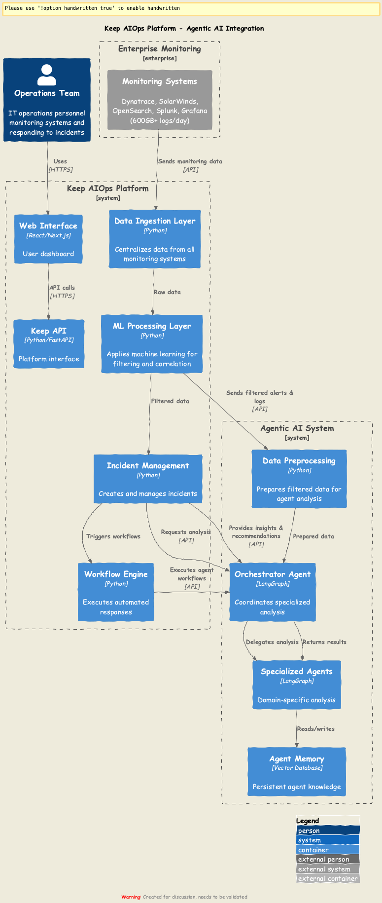

# Executive Summary: Agentic AI Integration with Keep AIOps Platform

## The Challenge

Our enterprise monitoring systems generate over 600GB of log data daily from multiple sources including Dynatrace, SolarWinds, OpenSearch, Splunk, and Grafana. This massive volume of data presents significant challenges:

1. Information overload for operations teams
2. Critical incidents buried in noise
3. Manual correlation across systems is time-consuming
4. Root cause analysis requires deep expertise
5. Response time slowed by data complexity

## The Solution

We propose integrating intelligent Agentic AI capabilities with the open-source Keep AIOps platform to create a tiered processing architecture that efficiently handles our high-volume environment.

## Key Benefits

| Challenge | Solution | Benefit |
|-----------|----------|---------|
| Information overload | ML-based filtering | 98% reduction in data requiring human attention |
| Manual correlation | Automated context assembly | Connections identified across disparate systems |
| Expertise gaps | Specialized AI agents | Domain expertise available 24/7 |
| Slow response | Automated analysis and recommendations | Reduced MTTR (Mean Time to Resolution) |
| Recurring issues | AI memory and learning | Continuous improvement of incident handling |

## How It Works

1. **Data Centralization**: Keep platform ingests all monitoring data (600GB+/day)
2. **Intelligent Filtering**: Keep's ML algorithms identify relevant anomalies
3. **Smart Preprocessing**: Only filtered data (approximately 2%) passes to AI analysis
4. **Specialized Analysis**: Domain-specific AI agents perform deep analysis
5. **Actionable Insights**: The system provides root cause analysis and remediation suggestions

## Technology Stack

- **Keep AIOps Platform**: Open-source foundation with proven scalability
- **LangGraph Framework**: Enabling sophisticated multi-agent reasoning
- **Vector Database**: For efficient AI memory and learning
- **Fine-tuned Language Models**: Customized for our specific infrastructure and applications

## Implementation Timeline

| Phase | Timeframe | Focus |
|-------|-----------|-------|
| 1 | Q3 2023 | Keep platform deployment and integration with monitoring systems |
| 2 | Q4 2023 | Enhanced ML filtering and preprocessing pipeline |
| 3 | Q1 2024 | Initial orchestrator agent and first specialized agent |
| 4 | Q2 2024 | Complete agent ecosystem and memory system |
| 5 | Q3 2024 | Human feedback integration and continuous improvement |

## Financial Impact

- **OPEX Reduction**: Estimated 40% reduction in level 1 support requirements
- **MTTR Improvement**: Projected 65% reduction in mean time to resolution
- **Incident Prevention**: Proactive remediation of 25% of potential incidents
- **ROI**: Expected return on investment within 9 months of full deployment

## Next Steps

1. Proceed with Phase 1 implementation
2. Establish baseline metrics for current incident management
3. Develop evaluation framework for measuring improvements
4. Begin knowledge collection for agent fine-tuning

## Conclusion

By integrating Agentic AI capabilities with the Keep AIOps platform, we can transform our approach to infrastructure monitoring and incident management. The tiered processing architecture efficiently handles our massive log volumes while providing intelligent, contextual insights for faster resolution and continuous improvement.

## Detailed Architecture

For a more detailed view of the architecture, please see:

The detailed architecture diagram shows the specific components and data flows between the Keep AIOps platform and the Agentic AI system, illustrating how the tiered processing approach handles the high volume of monitoring data. 