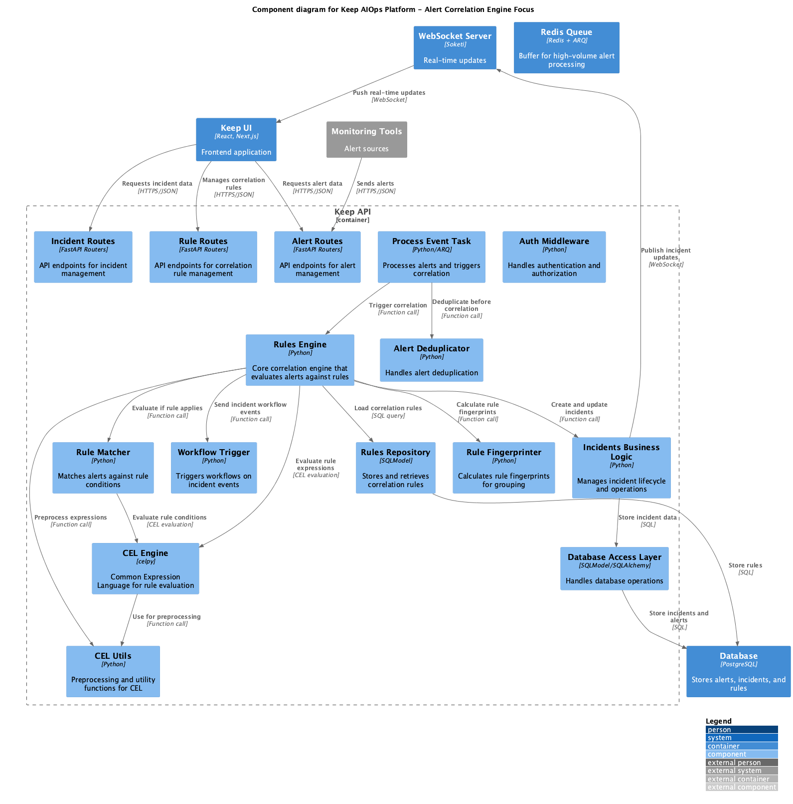
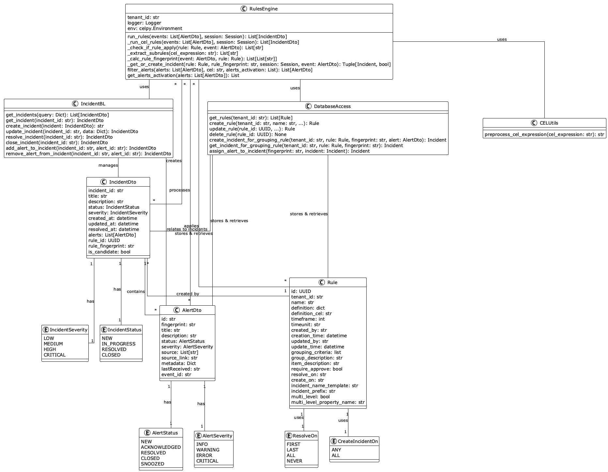
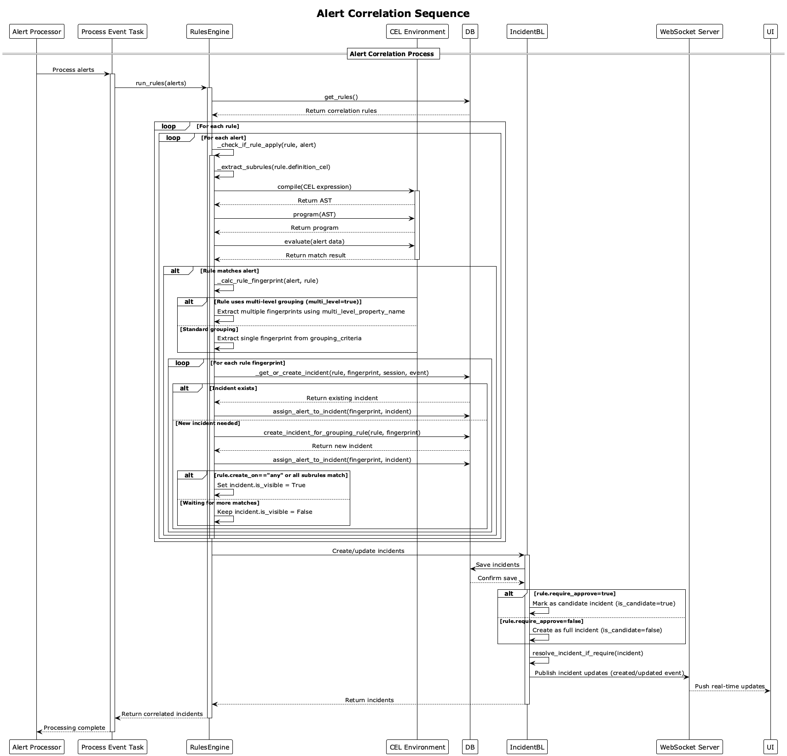

# Keep AIOps Alert Correlation Engine

## Overview

The Alert Correlation Engine in Keep AIOps is a sophisticated system designed to analyze incoming alerts, identify patterns and relationships, and group related alerts into meaningful incidents. This module enables effective incident management by reducing alert noise and helping operators focus on significant issues rather than individual symptoms. The correlation engine is particularly valuable for high-volume environments (processing ~600GB/day of logs, events, and alerts).

## Architecture

### Key Components

The Alert Correlation Engine consists of the following key components, which directly map to the source code:

1. **Rules Engine**
   - Core class: `RulesEngine` (`keep/rulesengine/rulesengine.py`)
   - Evaluates alerts against correlation rules
   - Calculates rule fingerprints for alert grouping
   - Creates incidents based on rule matches
   - Manages multi-level grouping for complex relationships

2. **CEL Environment**
   - Leverages Common Expression Language (CEL) for rule conditions
   - Provides flexible, expressive condition syntax
   - Supports complex logical operations (AND, OR, NOT)
   - Allows access to all alert attributes in expressions

3. **Rule Definition Framework**
   - Data model: `Rule` class
   - Supports time-based correlation windows
   - Configurable grouping criteria
   - Control over incident creation/visibility logic
   - Template-based incident naming

4. **Alert Processor**
   - Handles alert pre-processing before correlation
   - Integrates with alert deduplication
   - Manages high-volume throughput with Redis queue
   - Passes normalized alerts to Rules Engine

5. **Database Access Layer**
   - Stores and retrieves correlation rules
   - Manages incident-alert relationships
   - Handles rule fingerprint lookups
   - Supports efficient querying patterns for high volume

### Class Diagram

The following class diagram illustrates the relationships between the key classes in the Alert Correlation Engine:

### Integration with Other Modules

The Alert Correlation Engine integrates with other Keep AIOps components:

1. **Alert Ingestion & Processing**
   - Receives normalized alerts for correlation
   - Leverages fingerprinting for alert identification
   - Processes alerts in batches for efficiency

2. **Incident Management**
   - Creates and updates incidents based on correlation results
   - Manages incident lifecycle (creation, update, resolution)
   - Publishes incident events via WebSockets

3. **Workflow Automation**
   - Triggers workflows based on incident creation/updates
   - Enables automated responses to correlated incidents
   - Supports sophisticated incident handling processes

4. **UI Components**
   - Provides visualization of correlation rules
   - Supports rule creation and management
   - Displays incident grouping and relationships

## Correlation Logic

### Rule Types and Evaluation

The correlation engine supports several types of rules:

1. **Condition-Based Rules**
   - CEL expressions define matching conditions
   - Supports complex logical operations (AND, OR, NOT)
   - Example: `(source == "prometheus" && severity == "critical") || (source == "grafana" && contains(description, "disk"))`

2. **Time-Based Rules**
   - Configurable time windows for correlation
   - Groups alerts occurring within specified timeframes
   - Supports different time units (seconds, minutes, hours)

3. **Topology-Based Rules**
   - Leverages infrastructure relationships
   - Groups alerts based on affected components
   - Understands parent-child relationships

4. **Multi-Level Grouping Rules**
   - Creates multiple incidents from a single rule
   - Groups by different values of a specified property
   - Useful for service-based or customer-based grouping

### Fingerprinting Mechanism

The correlation engine uses a sophisticated fingerprinting mechanism to determine which alerts should be grouped together:

1. **Rule Fingerprints**
   - Derived from alert attributes specified in grouping criteria
   - Uniquely identifies groups of related alerts
   - Example: for grouping criteria `["labels.host", "labels.service"]`, the fingerprint might be `["host123", "database"]`

2. **Multi-Level Fingerprints**
   - Creates multiple fingerprints for a single alert
   - Enables one alert to be part of multiple incidents
   - Supports complex grouping scenarios

3. **Fingerprint Lifecycle**
   - Time-based expiration of fingerprints
   - Rules can specify when incidents should be closed or reopened
   - Supports different incident resolution strategies

## Workflows

### Alert Correlation Process

The correlation process follows these steps, as illustrated in the sequence diagram:

1. The `Process Event Task` sends alerts to the `RulesEngine` for correlation
2. The `RulesEngine` retrieves all active correlation rules from the database
3. For each rule and alert combination:
   - The engine checks if the rule applies using CEL evaluation
   - If matched, it calculates rule fingerprints based on grouping criteria
   - It retrieves or creates incidents based on fingerprints
   - It assigns alerts to the appropriate incidents
   - It determines incident visibility based on rule configuration
4. The `RulesEngine` creates or updates incidents through the `IncidentBL`
5. Incident updates are published to clients via WebSockets

### Sequence Diagram

The following sequence diagram illustrates the correlation workflow:

### Incident Creation Logic

Incidents are created based on rule configurations:

1. **Creation Conditions**
   - `create_on` setting determines when incidents become visible:
     - `ANY`: First matching alert creates an incident
     - `ALL`: All subrules must match at least one alert

2. **Approval Requirements**
   - `require_approve` setting controls automatic vs. manual creation:
     - `true`: Creates "candidate" incidents requiring manual approval
     - `false`: Creates fully visible incidents automatically

3. **Resolution Logic**
   - `resolve_on` settings control when incidents are resolved:
     - `FIRST`: When the first alert is resolved
     - `LAST`: When the last alert is resolved
     - `ALL`: When all alerts are resolved
     - `NEVER`: Manual resolution only

## Data Models

### Core Classes

The module's implementation is built around these key classes:

1. **Rule**
   - Properties:
     - `id`: UUID - Unique identifier
     - `tenant_id`: str - Tenant identifier
     - `name`: str - Rule name
     - `definition_cel`: str - CEL expression for rule conditions
     - `timeframe`: int - Time window for correlation
     - `timeunit`: str - Unit for timeframe (seconds, minutes, hours)
     - `grouping_criteria`: list - Alert attributes used for fingerprinting
     - `require_approve`: bool - Whether incidents require manual approval
     - `resolve_on`: str - When incidents should be resolved
     - `create_on`: str - When incidents should be created
     - `incident_name_template`: str - Template for incident names
     - `multi_level`: bool - Support for multi-level grouping
     - `multi_level_property_name`: str - Property used for multi-level grouping

2. **RulesEngine**
   - Methods:
     - `run_rules(events)`: Evaluates rules against events
     - `_check_if_rule_apply(rule, event)`: Checks if a rule matches an event
     - `_calc_rule_fingerprint(event, rule)`: Calculates fingerprints for grouping
     - `_get_or_create_incident(rule, fingerprint, session, event)`: Gets or creates an incident
     - `_extract_subrules(expression)`: Extracts subrules from a CEL expression

3. **CEL Environment**
   - Provides expression evaluation capabilities
   - Supports attribute access for alert properties
   - Handles various data types and operations

### Data Flow

The correlation engine's data flow follows this pattern:

1. Alerts are received from the Alert Processing module
2. Rules are retrieved from the database
3. Alerts are evaluated against rules
4. Rule fingerprints are calculated
5. Incidents are created or updated
6. Alerts are assigned to incidents
7. Updated incidents are persisted to the database
8. WebSocket notifications are sent to clients

## Implementation Details

### CEL Expression Evaluation

The correlation engine uses the Common Expression Language (CEL) for rule evaluation:

1. **Expression Preprocessing**
   - Expressions are preprocessed for compatibility
   - Special cases like `null` comparisons are handled
   - Sub-rules are extracted for individual evaluation

2. **Alert Payload Preparation**
   - Alert data is converted to CEL-compatible format
   - Sanitization removes invalid field names
   - Type conversion ensures proper evaluation

3. **Evaluation Process**
   - Each sub-rule is compiled to an AST
   - The AST is converted to an executable program
   - The program is evaluated against alert data
   - Results determine if the rule matches

### Rule Fingerprint Calculation

The fingerprinting process follows these steps:

1. **Attribute Extraction**
   - Values are extracted from alerts based on grouping criteria
   - For example, if grouping by `["labels.host", "severity"]`, values might be `["host123", "critical"]`

2. **Fingerprint Generation**
   - For standard rules, a single fingerprint is generated
   - For multi-level rules, multiple fingerprints may be generated
   - Special handling for missing values or complex attributes

3. **Incident Lookup**
   - Fingerprints are used to find existing incidents
   - Time-based expiration checks determine if new incidents should be created
   - Alerts are assigned to matching incidents

### Dynamic Incident Naming

The correlation engine supports dynamic incident naming:

1. **Template Variables**
   - Alert attributes can be referenced using `{{alert.attribute}}` syntax
   - Example: "Service outage on {{alert.labels.host}}"

2. **Multi-Alert Handling**
   - For incidents with multiple alerts, values are aggregated
   - Duplicate values are automatically deduplicated
   - Names update as new alerts are added

3. **Name Generation**
   - Alert attributes are extracted and substituted in templates
   - Optional prefixes can be added (e.g., "INC-1234 - Service outage")
   - Default naming falls back to rule name if no template is provided

## Performance Optimizations

For high-volume environments (~600GB/day), the correlation engine implements several optimizations:

1. **Efficient Rule Evaluation**
   - Rules are preprocessed for faster evaluation
   - CEL expressions are compiled once and reused
   - Sub-rule extraction enables partial matching

2. **Fingerprint-Based Lookups**
   - Fast indexed lookups for incident matching
   - Avoid full table scans for high-volume correlation
   - Efficient storage of rule-alert relationships

3. **Batched Processing**
   - Alerts are processed in batches
   - Database operations are optimized for batch patterns
   - Connection pooling reduces overhead

4. **Time-Window Optimizations**
   - Time-based expiration limits correlation scope
   - Only active time windows are considered
   - Reduces computational load for long-running rules

## Management Interface

The correlation engine provides several management interfaces:

1. **Rule Management API**
   - CRUD operations for correlation rules
   - Testing and validation capabilities
   - Rule import/export

2. **Rule Editor UI**
   - Visual rule creation and editing
   - Condition builder with expression validation
   - Grouping criteria configuration

3. **Monitoring Capabilities**
   - Rule performance metrics
   - Hit count and effectiveness statistics
   - Correlation success tracking

## Deployment Considerations

For deploying the Alert Correlation Engine in high-volume environments:

1. **Database Scalability**
   - Properly indexed tables for rule and fingerprint lookups
   - Optimized queries for high-throughput operations
   - Connection pooling configuration

2. **Processing Resources**
   - CPU allocation for CEL expression evaluation
   - Memory for rule compilation and evaluation
   - Queue management for burst handling

3. **Tuning Parameters**
   - Rule timeout configuration
   - Batch size optimization
   - Time window granularity adjustment

## Conclusion

The Alert Correlation Engine is a critical component of Keep AIOps, enabling efficient incident management by intelligently grouping related alerts. Its flexible rule system, powerful expression language, and optimized implementation make it ideal for high-volume environments processing ~600GB/day of logs, events, and alerts. The engine significantly reduces alert noise, improves mean time to detection (MTTD), and helps operators focus on meaningful incidents rather than individual symptoms. 