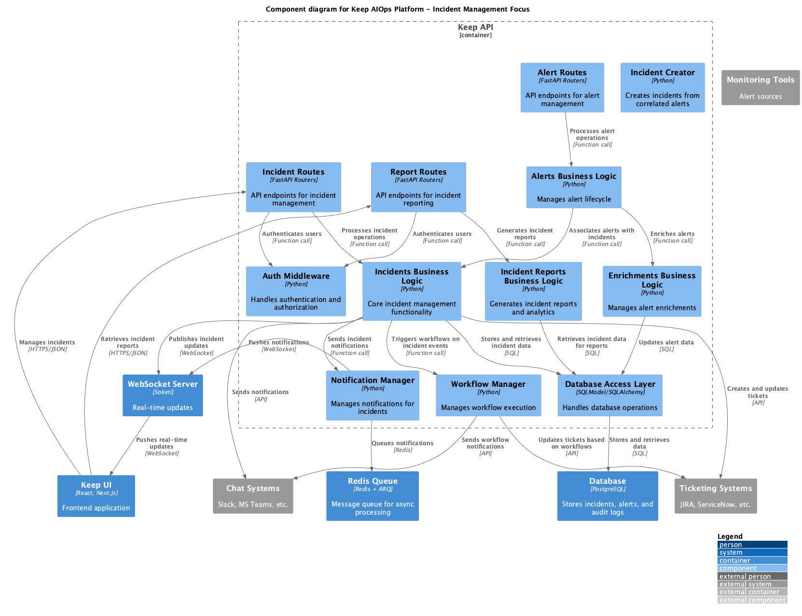

# Keep AIOps Incident Management

## Overview

The Incident Management module in Keep AIOps is the central hub for tracking, managing, and resolving operational issues. This module processes incidents generated from the Alert Correlation Engine and provides a comprehensive workflow for incident lifecycle management. The Incident Management system is designed to handle high-volume environments (processing ~600GB/day of logs, events, and alerts), enabling efficient incident tracking and resolution in large-scale IT operations.

## Architecture

### Key Components

The Incident Management module consists of the following key components, which directly map to the source code:

1. **Incident Business Logic**
   - Core class: `IncidentBl` (`keep/api/bl/incidents_bl.py`)
   - Handles incident creation, updates, and status changes
   - Manages alert-to-incident relationships
   - Integrates with workflow engine for automation
   - Provides real-time notifications via WebSockets

2. **Incident Model**
   - Core class: `Incident` (`keep/api/models/db/incident.py`)
   - Defines incident properties and relationships
   - Supports status transitions (FIRING, ACKNOWLEDGED, RESOLVED, MERGED)
   - Tracks severity levels, assignees, and timestamps
   - Manages relationship with associated alerts

3. **Incident Reports Logic**
   - Core class: `IncidentReportsBl` (`keep/api/bl/incident_reports.py`)
   - Generates incident reports and metrics
   - Calculates MTTD (Mean Time to Detect) and MTTR (Mean Time to Resolve)
   - Provides service impact analysis
   - Integrates with LLMs for incident reason classification

4. **Incident Database Operations**
   - Handles persistence and retrieval of incident data
   - Manages incident-alert relationships
   - Maintains audit logs of incident changes
   - Optimized for high-volume environments

5. **Notification System**
   - Publishes real-time updates via WebSockets
   - Triggers workflows on incident state changes
   - Integrates with external notification services
   - Handles enrichment-based notifications

### Class Diagram

The following class diagram illustrates the relationships between the key classes in the Incident Management module:

### Integration with Other Modules

The Incident Management module integrates with other Keep AIOps components:

1. **Alert Correlation Engine**
   - Receives correlated alerts for incident creation
   - Applies rule-based incident creation logic
   - Maintains rule fingerprints for incident grouping

2. **Workflow Automation**
   - Triggers workflows on incident creation, updates, and resolution
   - Automates response actions based on incident properties
   - Facilitates integration with external systems

3. **ML-Based Anomaly Detection**
   - Integrates AI-suggested incidents
   - Utilizes AI for incident summary generation
   - Applies ML for recurring incident detection

4. **UI Components**
   - Provides real-time incident status updates
   - Supports incident assignment and management
   - Displays incident timelines and metrics

## Incident Data Model

### Core Classes

The module's implementation is built around these key classes:

1. **Incident**
   - Properties:
     - `id`: UUID - Unique identifier
     - `tenant_id`: str - Tenant identifier
     - `running_number`: int - Auto-incrementing number for human-readable reference
     - `user_generated_name`: str - User-provided incident name
     - `ai_generated_name`: str - AI-suggested incident name
     - `user_summary`: str - User-provided incident summary
     - `generated_summary`: str - AI-generated incident summary
     - `assignee`: str - User assigned to the incident
     - `severity`: int - Incident severity level
     - `status`: str - Current incident status (FIRING, ACKNOWLEDGED, RESOLVED, MERGED)
     - `creation_time`: datetime - When the incident was created
     - `start_time`: datetime - When the incident started (from first alert)
     - `end_time`: datetime - When the incident was resolved
     - `last_seen_time`: datetime - When the incident was last updated
     - `is_candidate`: bool - Whether the incident requires approval
     - `is_visible`: bool - Whether the incident is visible to all users
     - `alerts_count`: int - Number of alerts in this incident
     - `affected_services`: list - List of services affected by this incident
     - `sources`: list - List of alert sources for this incident
     - `rule_id`: UUID - ID of the rule that created this incident
     - `rule_fingerprint`: str - Fingerprint of the rule for grouping
     - `fingerprint`: str - Unique identifier for deduplication
     - `incident_type`: str - Type of incident (MANUAL, AI, RULE, TOPOLOGY)
     - `resolve_on`: str - When to resolve the incident (FIRST, LAST, ALL, NEVER)
     - `merged_into_incident_id`: UUID - ID of incident this was merged into
     - Methods:
       - `alerts`: property that returns associated alerts
       - `enrichments`: property that returns enrichment data

2. **IncidentStatus (Enum)**
   - Values:
     - `FIRING`: Newly created incident requiring attention
     - `ACKNOWLEDGED`: Incident has been acknowledged but not resolved
     - `RESOLVED`: Incident has been resolved
     - `MERGED`: Incident has been merged into another incident
     - `DELETED`: Incident has been deleted
   - Methods:
     - `get_active()`: Returns list of active statuses
     - `get_closed()`: Returns list of closed statuses

3. **IncidentSeverity (Enum)**
   - Values:
     - `CRITICAL`: Highest severity level (5)
     - `HIGH`: High severity level (4)
     - `WARNING`: Medium severity level (3)
     - `INFO`: Informational severity level (2)
     - `LOW`: Lowest severity level (1)
   - Methods:
     - `from_number(n)`: Converts numeric value to severity

4. **IncidentType (Enum)**
   - Values:
     - `MANUAL`: Created manually by users
     - `AI`: Created or suggested by AI
     - `RULE`: Created by correlation rules
     - `TOPOLOGY`: Created based on infrastructure topology

### Database Schema

The incident data is stored in these key tables:

1. **Incident Table**
   - Stores core incident data
   - Indexed on tenant_id and status for efficient queries
   - Includes foreign keys to related rules

2. **AlertToIncident Table**
   - Many-to-many relationship between alerts and incidents
   - Tracks which alerts are part of which incidents
   - Records whether the relationship was created by AI

3. **LastAlertToIncident Table**
   - Performance optimization table for high-volume environments
   - Stores only the most recent alert-to-incident mapping
   - Indexed for fast fingerprint-based lookups

## Incident Lifecycle

### Incident Creation

Incidents can be created through various mechanisms:

1. **Rule-Based Creation**
   - Correlation rules identify related alerts
   - Rule fingerprints determine alert grouping
   - Rule settings control incident visibility and approval requirements

2. **Manual Creation**
   - Users can create incidents directly
   - Alerts can be manually associated with incidents
   - Custom names and summaries can be provided

3. **AI-Suggested Creation**
   - ML models identify potential incidents
   - Users can approve or reject suggestions
   - AI provides recommended incident summaries

4. **Topology-Based Creation**
   - Created based on infrastructure topology relationships
   - Groups alerts affecting related services
   - Automatically updates when topology changes

### Status Transitions

The incident lifecycle follows this flow:

1. **Creation (FIRING)**
   - Incident starts in FIRING status
   - Real-time notifications sent to users
   - Workflows may be triggered automatically

2. **Acknowledgement (ACKNOWLEDGED)**
   - User acknowledges they're working on the incident
   - Incident status changes to ACKNOWLEDGED
   - Additional workflows may be triggered

3. **Resolution (RESOLVED)**
   - User resolves the incident
   - End time is recorded for metrics
   - Automatic alert status updates may occur
   - Resolution workflows are triggered

4. **Merging (MERGED)**
   - Incidents can be merged when duplicates are identified
   - Source incident marked as MERGED
   - Alerts transferred to target incident
   - Both incidents trigger workflow events

### Sequence Diagram

The following sequence diagram illustrates the incident lifecycle:

## Workflows

### Incident Assignment

Incidents can be assigned to specific users:

1. Users can self-assign incidents
2. Administrators can assign incidents to others
3. Assignment updates trigger notifications and workflows
4. Assignment history is tracked in audit logs

### Incident Enrichment

Incidents can be enriched with additional information:

1. **Automatic Enrichment**
   - Service information from topology data
   - Related incidents from historical data
   - Performance metrics from monitoring systems

2. **Manual Enrichment**
   - User-provided comments and notes
   - Status update reasons
   - Resolution steps and lessons learned

3. **AI Enrichment**
   - Automatically generated incident summaries
   - Suggested root causes
   - Similar past incidents identification

### Incident Reporting

The Incident Management module includes comprehensive reporting capabilities:

1. **Operational Metrics**
   - MTTD (Mean Time to Detect) calculation
   - MTTR (Mean Time to Resolve) calculation
   - Incident duration statistics
   - Severity distribution analysis

2. **Service Impact Analysis**
   - Most affected services reporting
   - Service-based incident grouping
   - Service dependency impact tracking

3. **AI-Enhanced Analytics**
   - Common incident reason classification
   - Recurring incident pattern detection
   - Intelligent incident summarization

## Implementation Details

### Incident Creation Logic

The incident creation follows this process:

1. `IncidentBl.create_incident()` is called with incident details
2. A new `Incident` record is created in the database
3. If created from a rule, relevant rule settings are applied
4. Alerts are linked to the incident via `AlertToIncident` records
5. WebSocket notifications are sent to clients
6. Workflows are triggered via `WorkflowManager`

### Status Change Logic

Status changes are handled as follows:

1. `IncidentBl.change_status()` is called with new status
2. Current incident is retrieved with associated alerts
3. Alert statuses are updated based on incident status change
4. Incident status, timestamps, and audit logs are updated
5. For RESOLVED status, incident end_time is set
6. WebSocket notifications and workflows are triggered

### Incident Merge Logic

Incident merging follows this process:

1. `IncidentBl.merge_incidents()` is called with source and target IDs
2. Source and target incidents are retrieved
3. Alerts from source are transferred to target
4. Source incident is marked as MERGED with reference to target
5. Target incident counts and timestamps are updated
6. WebSocket notifications are sent for both incidents
7. Workflows are triggered for both incidents

### Resolution Logic

Incidents can be resolved through different approaches:

1. **Manual Resolution**
   - User explicitly resolves the incident
   - Status changes to RESOLVED immediately
   - All alerts in the incident are marked as resolved

2. **Rule-Based Resolution**
   - Based on resolve_on setting of the rule:
     - FIRST: When first alert is resolved
     - LAST: When last alert is resolved
     - ALL: When all alerts are resolved
     - NEVER: Manual resolution only

3. **Automatic Resolution**
   - Topology-based incidents can resolve automatically when alerts clear
   - Integration with monitoring systems for synchronized resolution
   - Workflow-based automatic resolution based on conditions

## Performance Optimizations

For high-volume environments (~600GB/day), the Incident Management module implements several optimizations:

1. **Efficient Database Schema**
   - Optimized indexes for common query patterns
   - LastAlertToIncident table for performance
   - Tenant-based partitioning for large deployments

2. **Query Optimizations**
   - Targeted SELECT queries with proper filtering
   - Batched alert processing for incidents
   - Pagination for large result sets

3. **Caching Strategies**
   - Incident counts pre-calculated and cached
   - Service lists derived from alerts and cached
   - Calculated metrics stored for reuse

4. **Async Processing**
   - Asynchronous alert assignment to incidents
   - Background summary generation for large incidents
   - Parallel processing of incident notifications

## Integration Capabilities

The Incident Management module integrates with external systems through multiple channels:

1. **Incident Management Systems**
   - PagerDuty integration for bi-directional incident sync
   - ServiceNow integration for ticket creation
   - Incident.io integration for specialized incident management

2. **Chat Systems**
   - Slack integration for incident notifications and updates
   - Microsoft Teams integration for real-time alerts
   - Customizable message formatting

3. **Knowledge Base Systems**
   - Automatic documentation of incident resolution
   - Integration with wikis and knowledge bases
   - Capture of lessons learned

## Management Interface

The Incident Management module provides several management interfaces:

1. **Web UI**
   - Incident list with filtering and sorting
   - Incident details view with timeline
   - Action buttons for status changes and assignment
   - Analytics dashboard for incident metrics

2. **API Endpoints**
   - CRUD operations for incidents
   - Batch operations for efficient processing
   - Webhook support for integration

3. **Reporting Interface**
   - Scheduled report generation
   - Custom report creation
   - Export capabilities (CSV, PDF)

## Deployment Considerations

For deploying the Incident Management module in high-volume environments:

1. **Database Configuration**
   - Properly sized database instances
   - Optimized indexing strategy
   - Regular maintenance and vacuuming

2. **WebSocket Server Scaling**
   - Horizontal scaling of WebSocket servers
   - Load balancing for notification distribution
   - Connection pooling and management

3. **Workflow Engine Resources**
   - Dedicated resources for workflow processing
   - Parallel execution configuration
   - Timeout and retry settings

## Conclusion

The Incident Management module is a critical component of Keep AIOps, enabling efficient tracking, management, and resolution of incidents in high-volume environments processing ~600GB/day of logs, events, and alerts. Its flexible architecture, integration capabilities, and performance optimizations make it ideal for large-scale IT operations, significantly reducing mean time to resolution (MTTR) and improving overall operational efficiency. 