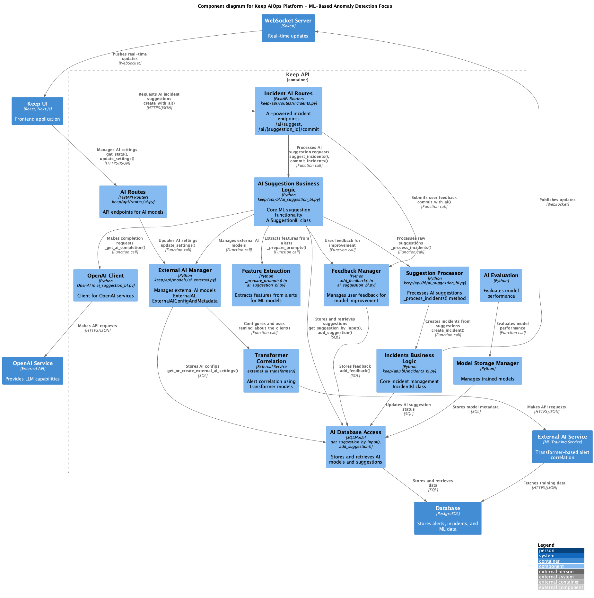
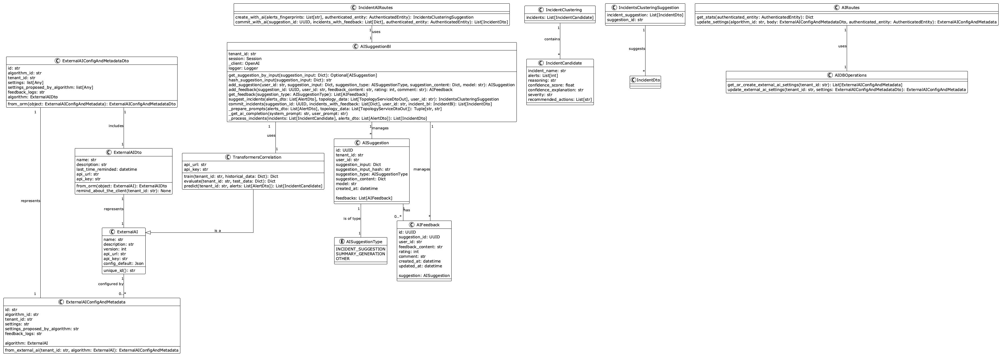
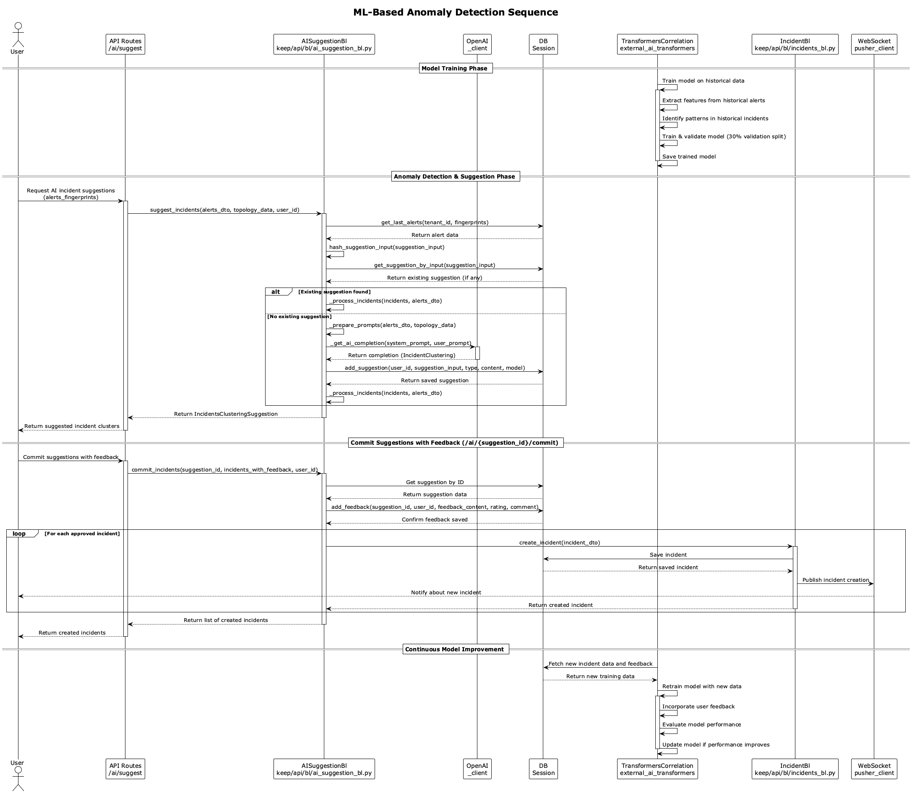

# Keep AIOps ML-Based Anomaly Detection

## Overview

The ML-Based Anomaly Detection module in Keep AIOps leverages machine learning and Large Language Models (LLMs) to identify patterns in alert data, detect anomalies, and automatically suggest potential incident groupings. This module enhances the platform's correlation capabilities by applying advanced AI techniques to process high volumes of alerts (supporting environments processing ~600GB/day of logs, events, and alerts).

## Architecture

### Key Components

The ML-Based Anomaly Detection module consists of the following key components, which directly map to the source code:

1. **External AI Framework**
   - Core abstraction: `ExternalAI` class (`keep/api/models/db/ai_external.py`)
   - Configuration storage: `ExternalAIConfigAndMetadata` class
   - API integration for external AI services
   - Tenant-specific settings management

2. **Transformer-Based Correlation**
   - Implementation: `TransformersCorrelation` class (extends `ExternalAI`)
   - Feature extraction from historical alert data
   - Pattern recognition through transformer models
   - Model training and evaluation pipeline
   - Alert-to-incident candidate mapping

3. **AI Suggestion Business Logic**
   - Core class: `AISuggestionBl` (`keep/api/bl/ai_suggestion_bl.py`)
   - Suggestion processing and management
   - OpenAI integration for intelligent clustering
   - Feature preparation from alerts and topology data
   - Cache management for performance optimization

4. **API Routes**
   - AI configuration: `AIRoutes` (`keep/api/routes/ai.py`)
   - Incident AI endpoints: `/ai/suggest` and `/ai/{suggestion_id}/commit` in `IncidentAIRoutes` (`keep/api/routes/incidents.py`)
   - Authentication and validation handling

5. **Feedback Collection System**
   - Feedback model: `AIFeedback` class (`keep/api/models/db/ai_suggestion.py`)
   - Rating and comment collection
   - Feedback incorporation into model training
   - Performance tracking for models

### Class Diagram

The following class diagram illustrates the relationships between the key classes in the ML-Based Anomaly Detection module:

### Integration with Other Modules

The ML-Based Anomaly Detection module integrates with other Keep AIOps components:

1. **Alert Ingestion & Processing**
   - Receives normalized alert data as input
   - Processes alert attributes for feature extraction
   - Utilizes alert fingerprints for identification

2. **Incident Management**
   - Converts AI-suggested clusters into incidents
   - Preserves reasoning and confidence information
   - Incorporates incident creation into feedback loop

3. **Knowledge Management**
   - Leverages historical incident data for training
   - Contributes to the knowledge base
   - Utilizes existing patterns for better suggestions

4. **UI Components**
   - Settings configuration interface
   - Suggestion review and approval UI
   - Feedback collection interface
   - Real-time updates via WebSockets

## Workflows

### Model Training Workflow

The model training workflow follows these steps, as illustrated in the sequence diagram:

1. The `TransformersCorrelation` service extracts features from historical alerts
2. The system identifies patterns in past alert-to-incident mappings
3. Model training occurs with a 30% validation split for performance evaluation
4. Trained models are saved for inference use

This process typically runs as a background task and when significant new data becomes available.

### Anomaly Detection & Suggestion Workflow

When users request AI incident suggestions:

1. The frontend makes a request to `/ai/suggest` with alert fingerprints
2. The `IncidentAIRoutes` forwards the request to `AISuggestionBl.suggest_incidents()`
3. The system retrieves full alert data and topology information
4. A suggestion input hash is generated for caching/deduplication
5. If a matching suggestion exists, it's retrieved from cache
6. Otherwise:
   - Feature extraction occurs via `_prepare_prompts()`
   - The system requests completion from OpenAI via `_get_ai_completion()`
   - The suggestion is processed and stored
7. Incident candidates are converted to `IncidentDto` objects
8. The system returns an `IncidentsClusteringSuggestion` with a `suggestion_id`

### Feedback and Continuous Improvement Workflow

User feedback drives model improvement:

1. Users review suggested incidents and provide feedback
2. The frontend posts to `/ai/{suggestion_id}/commit` with feedback
3. The system stores feedback via `add_feedback()`
4. Approved incidents are created in the incident management system
5. The `TransformersCorrelation` service periodically fetches new training data
6. Model retraining incorporates user feedback
7. Performance evaluation determines if the model should be updated

### Sequence Diagram

The following sequence diagram illustrates the key workflows in the ML-Based Anomaly Detection module:

## Data Models

### Core Classes

The module's implementation is built around these key classes:

1. **ExternalAI**
   - Represents AI algorithm configurations
   - Properties: name, description, version, api_url, api_key, config_default
   - Methods: unique_id()

2. **ExternalAIConfigAndMetadata**
   - Stores tenant-specific settings for AI algorithms
   - Properties: id, algorithm_id, tenant_id, settings, settings_proposed_by_algorithm, feedback_logs
   - Relationships: algorithm (ExternalAI)

3. **AISuggestion**
   - Records AI-generated suggestions
   - Properties: id, tenant_id, user_id, suggestion_input, suggestion_input_hash, suggestion_type, suggestion_content, model, created_at
   - Relationships: feedbacks (List[AIFeedback])

4. **AIFeedback**
   - Captures user feedback on suggestions
   - Properties: id, suggestion_id, user_id, feedback_content, rating, comment, created_at, updated_at
   - Relationships: suggestion (AISuggestion)

5. **TransformersCorrelation**
   - Extends ExternalAI for transformer-based correlation
   - Properties: api_url, api_key
   - Methods: train(), evaluate(), predict()

6. **AISuggestionBl**
   - Business logic for AI suggestion management
   - Properties: tenant_id, session, _client, logger
   - Methods: suggest_incidents(), commit_incidents(), etc.

7. **IncidentCandidate**
   - Represents a potential incident with grouped alerts
   - Properties: incident_name, alerts, reasoning, confidence_score, confidence_explanation, severity, recommended_actions

### Data Flow and Relationships

- `ExternalAI` is configured by `ExternalAIConfigAndMetadata` for tenant-specific settings
- `AISuggestionBl` manages `AISuggestion` records and their associated `AIFeedback`
- `IncidentClustering` contains multiple `IncidentCandidate` instances
- `IncidentsClusteringSuggestion` suggests multiple `IncidentDto` objects for creation

## Implementation Details

### Feature Extraction

The module extracts features from alerts and topology data via the `_prepare_prompts()` method in `AISuggestionBl`:

1. **Alert Content Analysis**
   - Extracts key information from alert titles and descriptions
   - Analyzes alert severity and source systems
   - Identifies temporal patterns

2. **Topology Utilization**
   - Incorporates infrastructure relationships from topology data
   - Identifies related services and dependencies
   - Provides context for more accurate grouping

### Model Training and Evaluation

The `TransformersCorrelation` service handles model lifecycle:

1. **Training Process**
   - Uses historical alert-to-incident mappings as training data
   - Extracts features from alert attributes
   - Trains transformer models with a 30% validation split
   - Evaluates performance on the validation set

2. **Inference Process**
   - Receives alerts for correlation
   - Extracts features from alert data
   - Applies the trained model to predict incident groupings
   - Returns incident candidates with confidence scores

### Suggestion Caching and Deduplication

For performance optimization, the system implements:

1. **Input Hashing**
   - `hash_suggestion_input()` creates a deterministic hash from inputs
   - This allows efficient lookup of previously processed alert sets

2. **Suggestion Storage**
   - `add_suggestion()` stores suggestions with their input hash
   - `get_suggestion_by_input()` retrieves cached suggestions

### OpenAI Integration

The module integrates with OpenAI for enhanced correlation:

1. **Prompt Preparation**
   - `_prepare_prompts()` creates system and user prompts from alert data
   - Prompts include alert details and topology context

2. **Completion Request**
   - `_get_ai_completion()` sends prompts to OpenAI
   - Parses the completion into an `IncidentClustering` structure

### Feedback Collection and Processing

The system collects feedback through:

1. **Feedback Storage**
   - `add_feedback()` records user ratings and comments
   - Associates feedback with the original suggestion

2. **Feedback Utilization**
   - Feedback is incorporated into model retraining
   - Patterns of accepted/rejected suggestions inform model improvement

## Performance Optimizations

For high-volume environments (~600GB/day), the module implements:

1. **Suggestion Caching**
   - Prevents redundant processing of identical alert sets
   - Reduces computational load and API costs

2. **Input Hashing**
   - Efficient lookup mechanism for similar alert patterns
   - Constant-time retrieval of existing suggestions

3. **Incremental Processing**
   - Processes new alerts incrementally rather than reprocessing everything
   - Focuses model retraining on new patterns

4. **Tenant Isolation**
   - Separate models and configurations per tenant
   - Prevents cross-tenant data leakage

## API Endpoints

### AI Configuration Endpoints

- **GET /ai/stats**
  - Returns statistics about AI models and suggestions
  - Implemented in `AIRoutes.get_stats()`

- **PUT /ai/settings/{algorithm_id}**
  - Updates AI algorithm settings
  - Implemented in `AIRoutes.update_settings()`

### Incident AI Endpoints

- **POST /ai/suggest**
  - Requests AI-suggested incident clusters from alert fingerprints
  - Implemented in `IncidentAIRoutes.create_with_ai()`

- **POST /ai/{suggestion_id}/commit**
  - Commits suggestions with user feedback
  - Creates incidents from approved suggestions
  - Implemented in `IncidentAIRoutes.commit_with_ai()`

## User Interface Components

The UI for the ML-Based Anomaly Detection module includes:

1. **AI Configuration Panel**
   - Settings for various AI algorithms
   - Performance metrics and statistics
   - Model training controls

2. **Suggestion Review Interface**
   - Displays AI-suggested incident clusters
   - Shows confidence scores and reasoning
   - Allows approval, modification, or rejection

3. **Feedback Collection**
   - Rating interface for suggestions
   - Comment fields for qualitative feedback
   - Performance tracking visualization

## Deployment Considerations

For deploying the ML-Based Anomaly Detection module:

1. **Resource Requirements**
   - CPU/GPU for transformer model training
   - Memory for feature extraction and processing
   - Database capacity for suggestion storage

2. **External Dependencies**
   - OpenAI API access for LLM capabilities
   - External AI service for transformer models
   - PostgreSQL database for data storage

3. **Scaling Options**
   - Vertical scaling for model training
   - Horizontal scaling for suggestion processing
   - Caching tier for performance optimization

## Conclusion

The ML-Based Anomaly Detection module enhances Keep AIOps' correlation capabilities by applying advanced AI techniques to alert data. Through transformer-based models and LLM integration, it identifies patterns and suggests incident groupings, while continuously improving through user feedback. This module is particularly valuable for high-volume environments where manual correlation becomes challenging. 